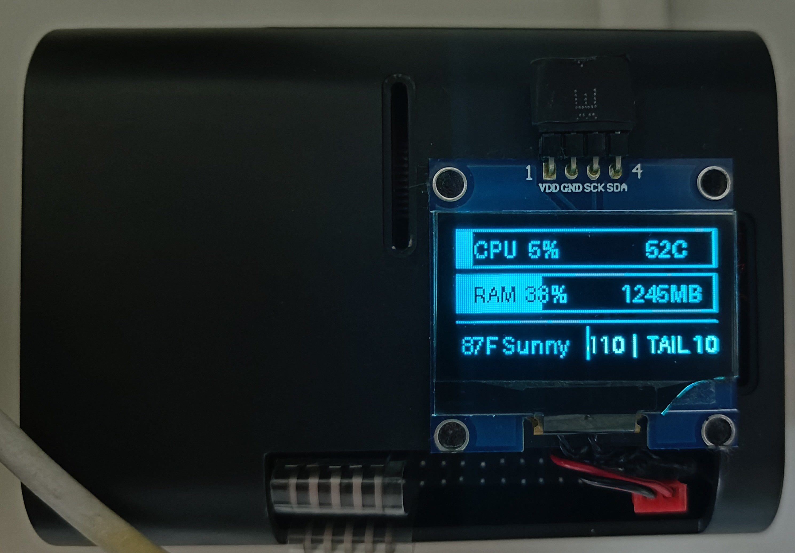

# PiDash128

PiDash128 is a compact Raspberry Pi dashboard for a 128×64 I²C OLED. It shows
CPU load, temperature, RAM usage, IP-based weather, and scrolling user/network
information.



## Hardware

- Raspberry Pi
- 128×64 SH1106 OLED connected over I²C
- Default I²C bus `1` and address `0x3C`

## Setup

```bash
cp .env.example .env
uv sync
```

Adjust `.env` for your display, then run:

```bash
uv run pi-dash-128
```

Press `Ctrl+C` to stop.

## Test commands

```bash
uv run pidash128-hello-test
uv run pidash128-resolution-test
uv run pidash128-system-info
```

Display settings and animation speed are configurable in `.env`. Weather is
provided by [wttr.in](https://wttr.in/) using IP-based location detection.
